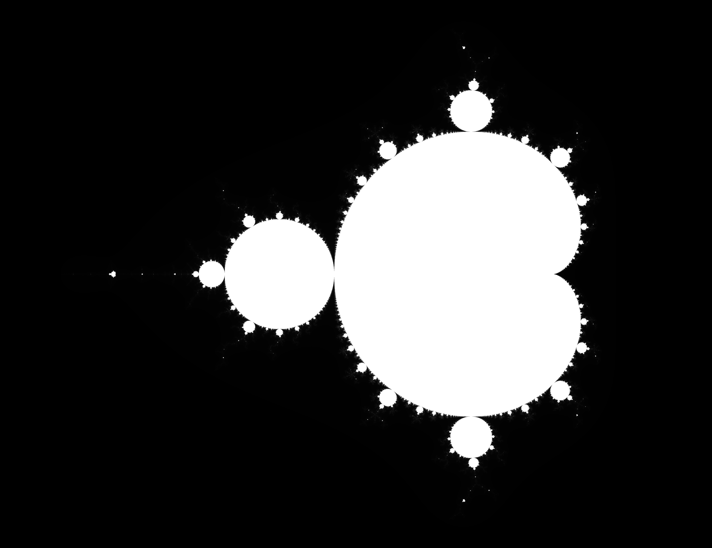
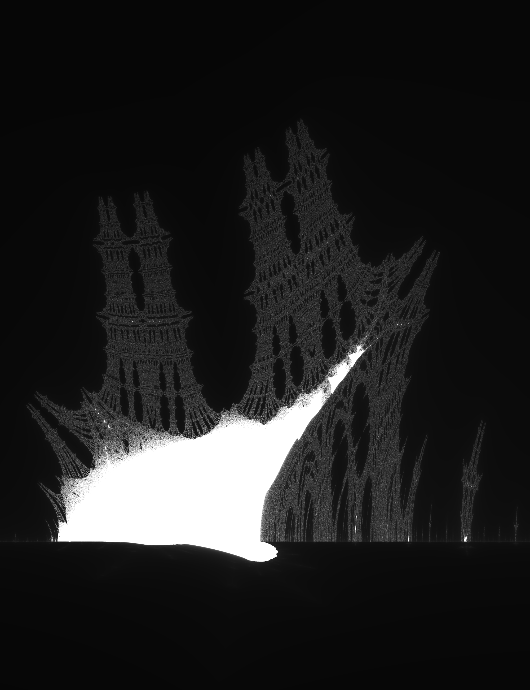
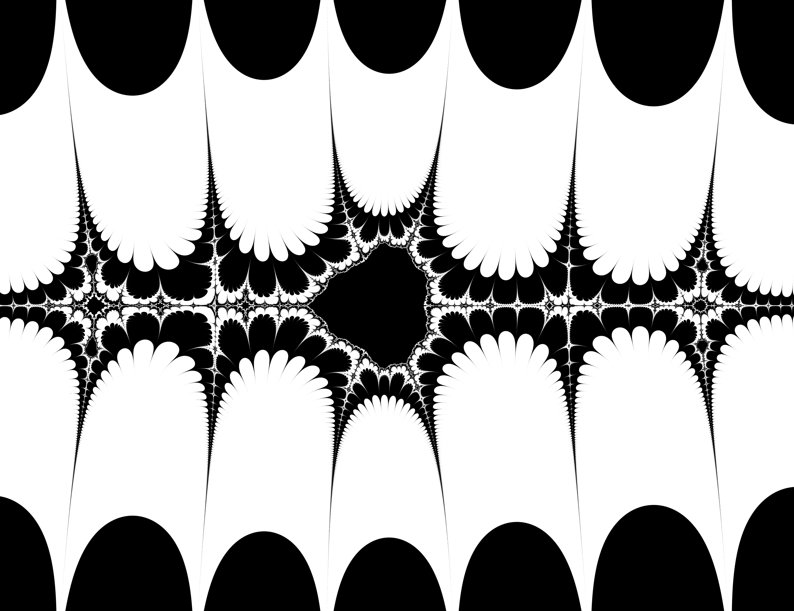
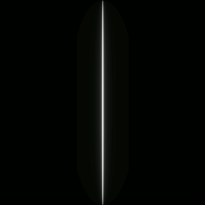
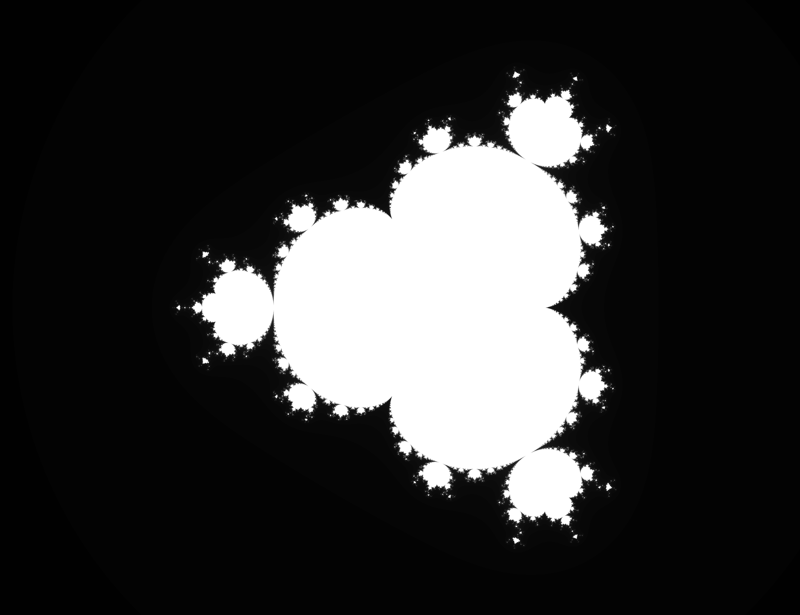
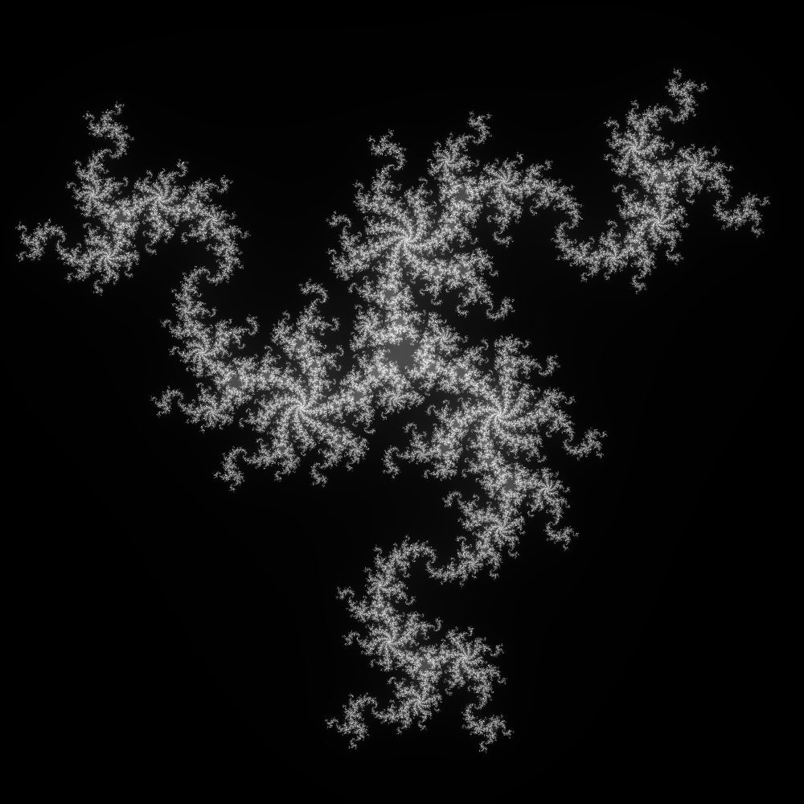
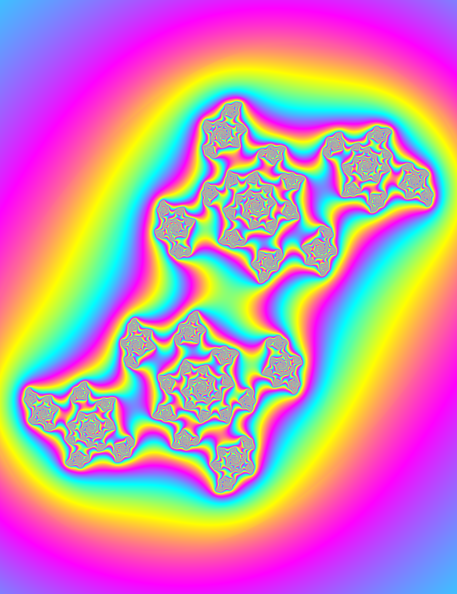
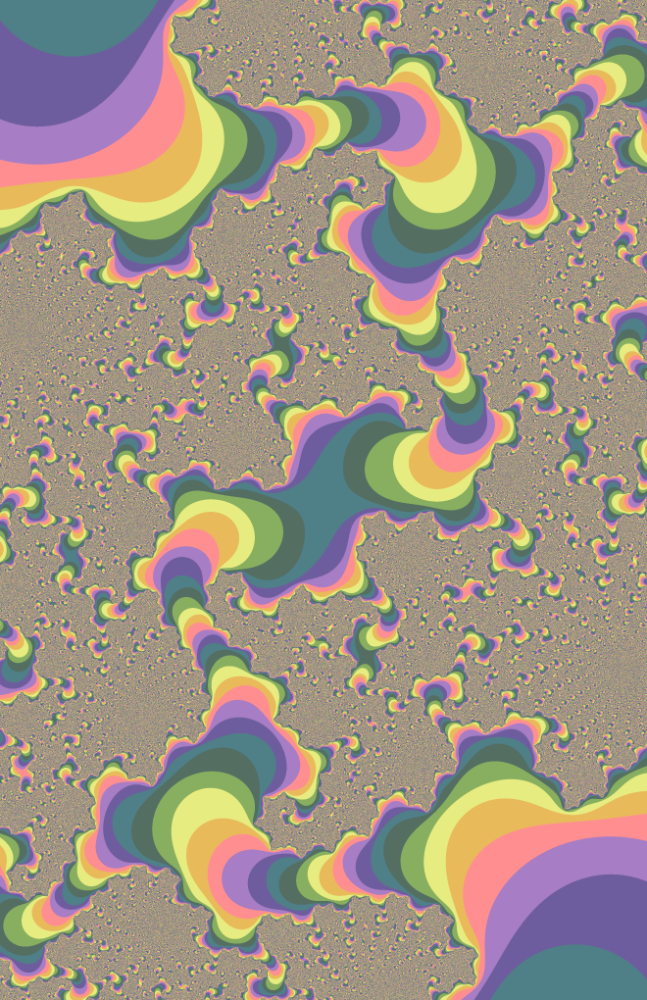
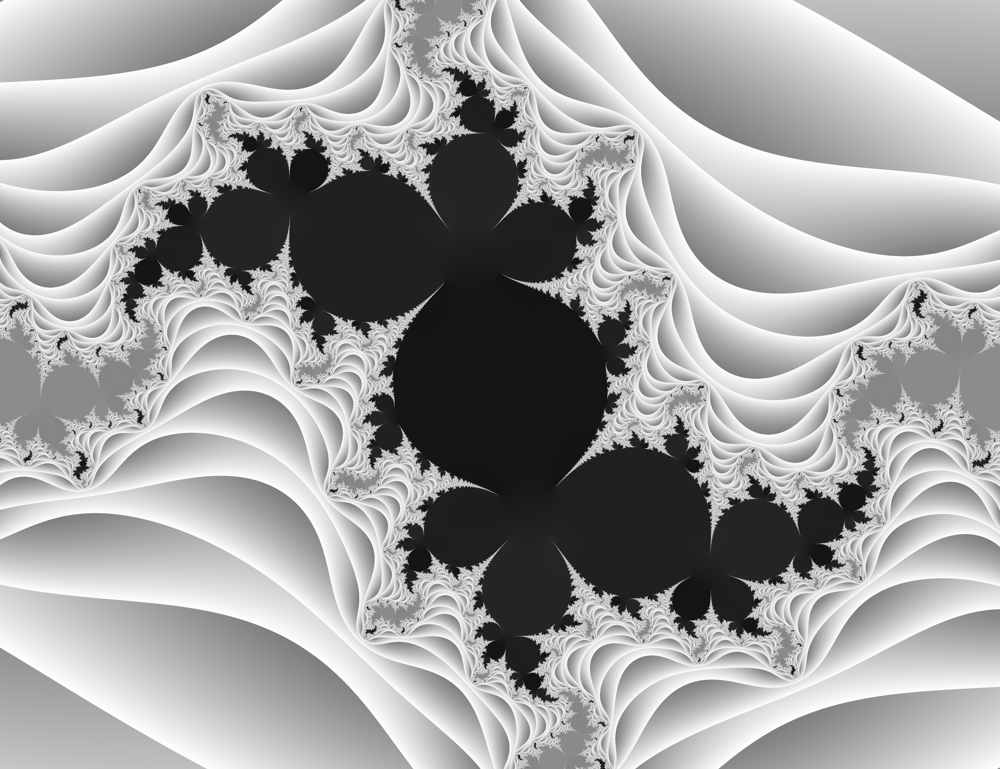

# Romanesgo

A simple fractal exploration program, named after the "cooler" version of broccoli.

Supported Fractals:

 - [The Mandelbrot set](#the-mandelbrot-set)
 - [Julia sets](#a-julia-set)
 - [The Burning Ship fractal](#the-burning-ship-fractal)
 - [The Collatz fractal](#the-collatz-fractal)
 - The Tricorn set
 - [Multicorn sets](#a-multicorn-animation)
 - [Multibrot sets](#a-multibrot-set)
 - [Multijulia sets](#a-multijulia-set)

## Contents

 - [Usage](#usage)
 - [Performance](#performance)
 - [Example Images](#example-images)

## Usage

``` 
$ ./romanesgo help

Do "romanesco help {Fractal Name}" for further info on a particular fractal function.

Fractals:
         burningship
         julia
         mandelbrot

Flags:
  -c value
        constants
  -cf string
        coloring function (default "default")
  -ff string
        fractal (default "none")
  -fn string
        filename (default "temp.png")
  -h int
        image height (default 1000)
  -i int
        maximum iterations (default 128)
  -r int
        goroutines used (default 8)
  -ss int
        supersampling factor (default 1)
  -w int
        image width (default 1000)
  -x float
        central x coord
  -y float
        central y coord
  -z float
        zoom factor (default 1)
```


## Performance

So, here's some usage on an i5-3320m (pretty old lil laptop processor):

```
$ ./romanesgo -ff=burningship -x=-1.748 -y=0.035 -z=20 -ss=4 -w=25000 -h=25000 -fn=bigship.png

	Fractal (ff):		 burningship 
	Constants (c):		  
	Max Iterations (i):	 128 
	Coloring function (cf): default 
	Centre x Coord (x):	 -1.748 
	Centre y Coord (y):	 0.035 
	Zoom factor (z):	 20 
	Image Width (w):	 25000 
	Image Height (h):	 25000 
	Supersampling (ss):	 4 
	Routines (r):		 4 
	Filename (png) (fn):	 bigship.png 

Routine 2 Done.
Routine 0 Done.
Routine 3 Done.
Routine 1 Done.

Time taken: 14m9.110651581s
```

What is that, a 625 megapixel image, in 14 minutes? I guess that's alright for an old laptop. :man_shrugging:

Oh, and that's with supersampling set to 4, so it's making 16 samples per pixel, which basically makes that equivalent to a 10 gigapixel image.


## Example images

### The Mandelbrot set
```
-w=2600 -h=2000 -ff=mandelbrot -x=-0.65 -z=0.8 -i=1024 -ss=2
```
<p align="center">
	
<p>

### A Julia set
```
-w=2600 -h=2000 -ff=julia -c=-0.2 -c=0.65 -z=0.9 -i=512 -ss=2
```
<p align="center">
	
</p>

### The Burning Ship fractal
```
-w=2000 -h=2600 -ff=burningship -x=-1.749 -y=0.037 -z=20 -i=256 -ss=2
```
<p align="center">
	
</p>

### The Collatz fractal
```
-ff=collatz -cf=wackyGrayscale -z=0.5 -w=2600 -h=2000 -ss=4 -i=8
```
<p align="center">
	
</p>

### A multicorn animation
See [samples/multicorn/multicorn-animation.sh](/samples/multicorn/multicorn-animation.sh)
```
for i in $(seq 1 0.04 5)
do
    ./romanesgo -ff=multicorn -i=256 -z=0.5 -ss=4 -w=400 -h=400 -c=$i -fn="samples/multicorn/frames/${i}.png"
done
```
<p align="center">
	
</p>

### A multibrot set
```
-ff=multibrot -c=4 -w=2600 -h=2000 -z=0.7 -x=-0.2 -ss=2
```
<p align="center">
	
</p>

### A multijulia set
```
-ff=multijulia -c=0.2 -c=0.9 -c=3 -z=0.8 -y=-0.15 -i=256 -ss=2
```
<p align="center">
	
</p>

### A smoothed RGB colouring function
```
-w=2000 -h=2600 -ff=julia -c=0.1 -c=0.7 -z=0.75 -ss=2 -cf=smoothcolor
```
<p align="center">
	
</p>

### A stepped RGB colouring function
```
-w=2000 -h=2600 -ff=julia -c=-0.22 -c=0.65 -z=8 -i=800 -ss=4 -cf=wackyRainbow
```
<p align="center">
	
</p>

### A stepped grayscale colouring function
```
-w=2600 -h=2000 -ff=julia -c=-0.2 -c=0.65 -z=5 -i=512 -ss=2 -cf=wackygrayscale
```
<p align="center">
	
</p>

### A smooth grayscale colouring function
```
-w=2600 -h=2000 -ff=mandelbrot -x=-0.82 -y=-0.1905 -z=50 -i=512 -ss=2 -cf=smoothgrayscale
```
<p align="center">
	
</p>

### Another smooth grayscale colouring function
```
-w=2600 -h=2000 -ff=julia -c=-1 -c=-0.25 -z=1.5 -i=512 -ss=2 -cf=zgrayscale
```
<p align="center">
	
</p>

### The Burning Ship Lady
```
-ff=burningship -z=100 -y=1.015 -cf=wackygrayscale -ss=8 -w=2000 -h=2000
```
<p align="center">
	
</p>
